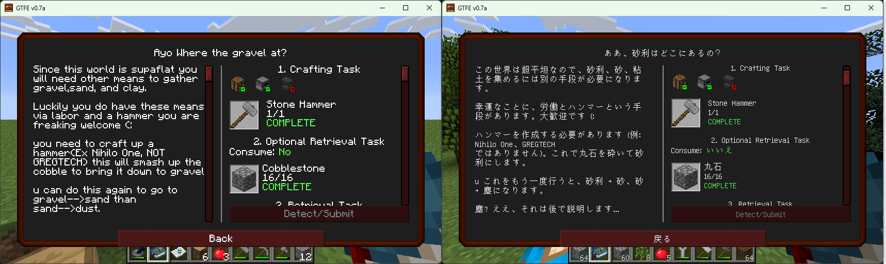

[English](./README.md) | [日本語](./README_ja.md)

# BetterQuesting Translation Tools

This is a tool for translating quest data of [BetterQuesting](https://www.curseforge.com/minecraft/mc-mods/better-questing).  
It extracts translatable text from JSON data and applies translated text back to JSON data.



## Overview

This project consists of two main scripts:

1. `toLangFile.js`: Extracts translatable text from JSON data and writes it to a CSV file.
2. `fromLangFile.js`: Applies translated CSV data to the original JSON data.

## Usage

### Prerequisites

- Node.js is installed.
    - Tested with Node.js v20.10.0.

### Setup

1. Clone this repository.

    ```bash
    git clone https://github.com/Kamesuta/betterquesting-translation-tools.git
    ```
    (or download and extract the zip file)

2. Install dependencies.

    ```bash
    npm install
    ```

### Conversion Steps

1. Place the JSON data of BetterQuesting in `toLang/DefaultQuests.json`.
     - Usually located at `config/betterquesting/DefaultQuests.json`.

2. Use `toLangFile.js` to extract translatable text and write it to a CSV file.

    ```bash
    # node src/toLangFile.js <path to input JSON file> <path to output CSV file>
    node src/toLangFile.js toLang/DefaultQuests.json toLang/lang.csv
    ```

3. Use Google Spreadsheet to convert the CSV to an Excel file.
    - In Google Spreadsheet, go to `File` -> `Import` -> `Upload` and upload the CSV file.
    - In the `Import file` dialog, uncheck `Convert text to numbers, dates, and formulas` and click `Import data`.
    - Go to `File` -> `Download` -> `Microsoft Excel (.xlsx)` to download the xlsx file.

4. Use Google Translate to translate the Excel file.
    - In Google Translate, select the `Documents` tab and upload the Excel file you want to translate.  
        https://translate.google.com/?op=docs
    - Click the `Translate` button to perform the translation.
    - Once the translation is complete, click the `Download translation` button to download the Excel file.
    

5. Use Google Spreadsheet to convert the Excel file to a CSV file.
    - In Google Spreadsheet, go to `File` -> `Import` -> `Upload` and upload the Excel file.
    - Go to `File` -> `Download` -> `Comma Separated Values (.csv)` to download the CSV file.
    - If the file import fails, open the CSV file in Microsoft Excel and save it again as `CSV UTF-8 (Comma delimited)(*.csv)` by going to `File` -> `Save As`.
    - Place the saved CSV file in `fromLang/lang.csv`.

6. Use `fromLangFile.js` to apply the translated CSV data to the original JSON data.

    ```bash
    # node src/fromLangFile.js <path to input JSON file> <path to input CSV file> <path to output JSON file>
    node src/fromLangFile.js toLang/DefaultQuests.json fromLang/lang.csv fromLang/DefaultQuests.json
    ```

7. Use `fromLang/DefaultQuests.json` as the JSON data for BetterQuesting.
    - Usually placed at `config/betterquesting/DefaultQuests.json`.

## Script Details

### toLangFile.js

- Recursively searches the JSON tree and extracts values corresponding to specific keys (`name:8`, `desc:8`, `Name:8`).
- The extracted values are written to a CSV file after replacing special characters `§` with `[§]` and line breaks `\n` with `\\n`.

### fromLangFile.js

- Reads the translated CSV data and applies it to the original JSON data.
- The translated values are reflected in the JSON data after converting `[§]` back to `§` and `\\n` back to `\n`.
- If a translation target key is not found, the corresponding key is logged.

## License

This project is provided under the MIT License.
