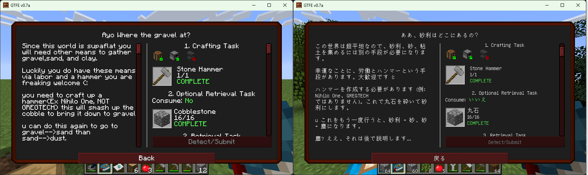
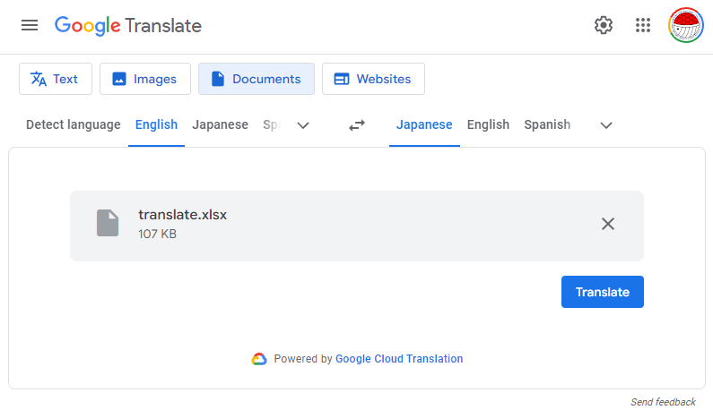

[English](./README.md) | [日本語](./README_ja.md)

# BetterQuesting 翻訳ツール

[BetterQuesting](https://www.curseforge.com/minecraft/mc-mods/better-questing) のクエストデータを翻訳するためのツールです。  
JSON データから翻訳可能なテキストを抽出し、翻訳後のテキストを JSON データに再度適用します。



## 概要

このプロジェクトは以下の2つの主要なスクリプトで構成されています：

1. `toLangFile.js`：JSON データから翻訳可能なテキストを抽出して CSV ファイルに書き出します。
2. `fromLangFile.js`：翻訳された CSV データを元の JSON データに適用します。

## 使用方法

### 前提条件

- Node.js がインストールされていること。
    - Node.js v20.10.0 で動作確認済みです。

### 準備

1. このリポジトリをクローンします。

    ```bash
    git clone https://github.com/Kamesuta/betterquesting-translation-tools.git
    ```
    (または zip ファイルをダウンロードして展開します)

2. 依存関係をインストールします。

    ```bash
    npm install
    ```

### 変換の手順

1. BetterQuesting の JSON データを `toLang/DefaultQuests.json` に配置します。
     - 通常は `config/betterquesting/DefaultQuests.json` にあります。

2. toLangFile.js を使用して、翻訳可能なテキストを抽出して CSV ファイルに書き出します。

    ```bash
    # node src/toLangFile.js <path to input JSON file> <path to output CSV file>
    node src/toLangFile.js toLang/DefaultQuests.json toLang/lang.csv
    ```

3. Google Spreadsheet を使用し、CSV を Excel ファイルに変換します。
    - Google Spreadsheet で `ファイル` -> `インポート` -> `アップロード` から CSV ファイルをアップロードします。
    - `ファイルをインポート` ダイアログで `テキストを数値、日付、数式に変換する` のチェックを外し、`データをインポート` をクリックします。
    - `ファイル` -> `ダウンロード` -> `Microsoft Excel (.xlsx)` から xlsx ファイルをダウンロードします。

4. Google 翻訳 を使用し、Excel ファイルを翻訳します。
    - Google 翻訳 で `ドキュメント` タブを選択し、翻訳したい Excel ファイルをアップロードします。  
        https://translate.google.com/?op=docs
    - `翻訳` ボタンをクリックし、翻訳を実行します。
    - 翻訳が完了したら、`翻訳をダウンロード` ボタンをクリックして Excel ファイルをダウンロードします。
    


5. Google Spreadsheet を使用し、Excel ファイルを CSV ファイルに変換します。
    - Google Spreadsheet で `ファイル` -> `インポート` -> `アップロード` から Excel ファイルをアップロードします。
    - `ファイル` -> `ダウンロード` -> `カンマ区切り形式 (.csv)` から CSV ファイルをダウンロードします。
    - ファイルのインポートに失敗する場合、Microsoft Excel で CSV ファイルを開き、`ファイル` -> `名前を付けて保存` から `CSV UTF-8 (コンマ区切り)(*.csv)` で保存し直します。
    - 保存した CSV を `fromLang/lang.csv` に配置します。

6. fromLangFile.js を使用して、翻訳された CSV データを元の JSON データに適用します。

    ```bash
    # node src/fromLangFile.js <path to input JSON file> <path to input CSV file> <path to output JSON file>
    node src/fromLangFile.js toLang/DefaultQuests.json fromLang/lang.csv fromLang/DefaultQuests.json
    ```

7. `fromLang/DefaultQuests.json` を BetterQuesting の JSON データとして使用します。
    - 通常は `config/betterquesting/DefaultQuests.json` に配置します。

## スクリプトの詳細

### toLangFile.js

- 再帰的に JSON ツリーを探索し、特定のキー（`name:8`, `desc:8`, `Name:8`）に対応する値を抽出します。
- 抽出された値は、特殊文字 `§` を `[§]` に、改行 `\n` を `\\n` に置き換えた上で、CSV ファイルに書き出されます。

### fromLangFile.js

- 翻訳された CSV データを読み込み、元の JSON データに適用します。
- 翻訳された値は、再び `[§]` を `§` に、`\\n` を `\n` に戻した上で JSON データに反映されます。
- 翻訳対象のキーが見つからなかった場合には、該当するキーがログに記録されます。

## ライセンス

このプロジェクトは MIT ライセンスの下で提供されています。
